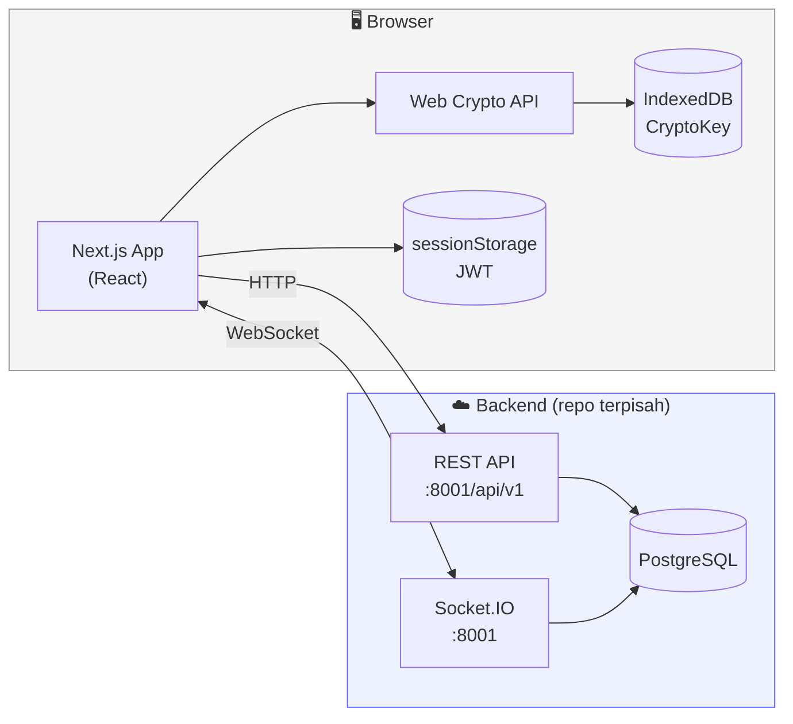
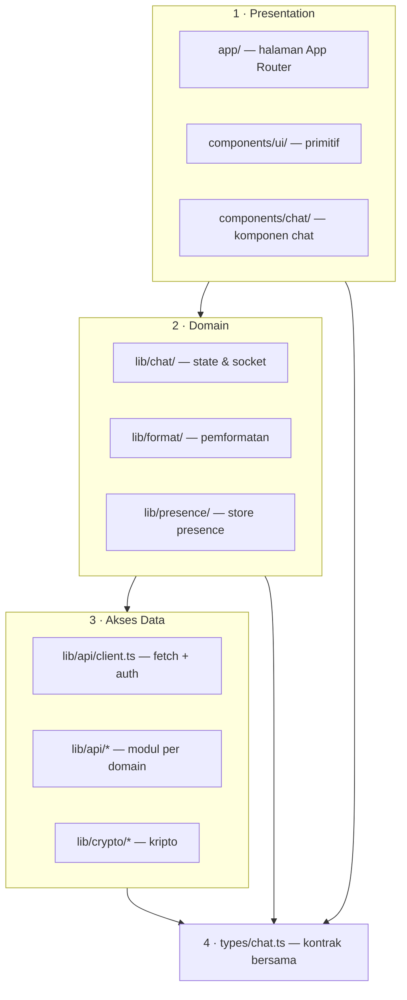
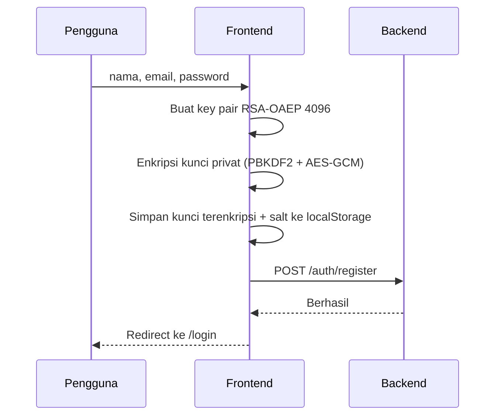

<div align="center">

<picture>
  <source media="(prefers-color-scheme: dark)" srcset="public/assets/logo/white.png">
  
</picture>

# Akselera Chat — Frontend

**Aplikasi chat internal dengan enkripsi end-to-end di sisi klien.**
Server menyimpan ciphertext. Kunci privat tidak pernah meninggalkan perangkat.

[](https://nextjs.org)
[](https://react.dev)
[](https://www.typescriptlang.org)
[](https://tailwindcss.com)
[](https://socket.io)

</div>

---

## Daftar Isi

- [Sekilas](#-sekilas)
- [Fitur](#-fitur)
- [Stack dan Alasan Memilihnya](#-stack-dan-alasan-memilihnya)
- [Arsitektur](#-arsitektur)
- [Keamanan dan Enkripsi](#-keamanan-dan-enkripsi)
- [Alur Utama](#-alur-utama)
- [Kontrak API](#-kontrak-api)
- [Menjalankan Secara Lokal](#-menjalankan-secara-lokal)
- [AI Tools yang Dipakai](#-ai-tools-yang-dipakai)
- [Yang Belum Selesai](#-yang-belum-selesai)
- [Catatan Sebelum Production](#-catatan-sebelum-production)

---

## 🔭 Sekilas

Frontend ini adalah sisi klien dari Akselera Chat. Tanggung jawabnya:

| | |
|---|---|
| 🔑 | Register, login, dan pembuatan key pair RSA per pengguna |
| 🔒 | **Enkripsi pesan di browser sebelum dikirim** — server tidak pernah melihat plaintext |
| 🔓 | Dekripsi di browser menggunakan kunci privat yang tersimpan lokal |
| 💬 | Daftar percakapan, unread count, pencarian, dan pembuatan percakapan |
| ⚡ | Pesan realtime lewat satu koneksi Socket.IO |
| 🎨 | Antarmuka monokrom dengan mode terang/gelap |

> **Catatan tentang password.** Password dikirim sebagai plaintext melalui HTTPS karena hanya backend yang boleh memverifikasinya. Hashing (Argon2id) dan penyimpanan hash sepenuhnya menjadi tanggung jawab backend. Frontend tidak pernah menyimpan password.

---

## ✨ Fitur

<details open>
<summary><b>Autentikasi</b></summary>

- Register dengan nama, email, dan password
- Pembuatan key pair RSA-OAEP 4096-bit saat register
- Kunci privat dienkripsi dengan password sebelum disimpan
- Login lewat `/auth/login`, lalu redirect otomatis ke `/chat`
- Logout menghapus kunci dari memori dan IndexedDB
- Redirect ke `/login` bila sesi tidak valid

</details>

<details>
<summary><b>Percakapan</b></summary>

- Daftar percakapan beserta unread count
- Pencarian percakapan secara lokal (tanpa request tambahan)
- Membuat percakapan baru lewat dialog, dengan pencarian pengguna via `/users`
- Hapus percakapan dan tandai sudah dibaca
- Percakapan dengan pesan terbaru naik ke posisi teratas secara realtime
- Status online / "terakhir dilihat" per lawan bicara

</details>

<details>
<summary><b>Pesan</b></summary>

- Riwayat pesan per percakapan
- Enkripsi sebelum dikirim; dekripsi di browser
- Gelembung pesan berbeda posisi dan warna untuk pengirim dan penerima
- Pemisah tanggal: `Hari ini`, `Kemarin`, atau tanggal lengkap
- Pesan baru masuk realtime tanpa reload
- Panel pesan otomatis menggulir ke bawah, tapi tidak memaksa kalau pengguna sedang membaca ke atas

</details>

---

## 🧱 Stack dan Alasan Memilihnya

### Ringkasan

| Lapisan | Pilihan | Versi | Alasan utama |
|---|---|---|---|
| Framework | **Next.js** (App Router) | 16.3.6 | Routing, bundling, dan metadata siap pakai tanpa konfigurasi manual |
| Bahasa | **TypeScript** (strict) | 5.9.3 | Kontrak data dipakai lintas lapisan; kesalahan bentuk data tertangkap saat compile |
| UI | **React** | 19.2.8 | `ref` sebagai prop biasa — tidak perlu `forwardRef` lagi |
| Styling | **Tailwind CSS** | 4.3.3 | Token tema di CSS, bukan di JavaScript; mode gelap cukup menukar nilai variabel |
| Ikon | **lucide-react** | 1.48 | Ringan, konsisten, dan bisa di-*tree-shake* |
| Realtime | **socket.io-client** | 4.8.4 | Reconnect otomatis dan semantik room bawaan |
| Kriptografi | **Web Crypto API** | native | Tidak menambah bundle dan tidak perlu mengaudit library kripto pihak ketiga |

### Alasan yang lebih detail

<details>
<summary><b>Kenapa Next.js App Router</b></summary>

Proyek ini butuh routing dan titik masuk server tanpa menulis server terpisah. Karena ini proyek baru — tidak ada kode lama yang harus dimigrasikan — konvensi App Router bisa dipakai langsung.

Praktiknya: halaman chat dan autentikasi ditandai `"use client"` karena seluruhnya interaktif, sementara `app/layout.tsx` tetap server component untuk menangani metadata dan pemuatan font.

</details>

<details>
<summary><b>Kenapa Web Crypto API, bukan library kripto</b></summary>

`crypto.subtle` sudah menyediakan RSA-OAEP dan AES-GCM secara native di browser. Memilih ini berarti:

- **Nol byte tambahan** pada bundle untuk fungsionalitas kripto
- **Tidak ada library pihak ketiga yang perlu diaudit** — permukaan serangan berkurang
- Operasi berat berjalan di kode native, bukan JavaScript

**Trade-off yang disadari:** API-nya low-level (banyak detail harus diurus sendiri) dan `SubtleCrypto` hanya tersedia di *secure context*. Artinya aplikasi **tidak bisa berjalan di HTTP biasa** selain `localhost`. Ini alasan `npm run dev` tetap berfungsi tanpa HTTPS, tapi deployment wajib HTTPS.

</details>

<details>
<summary><b>Kenapa envelope encryption RSA + AES</b></summary>

RSA-OAEP hanya praktis untuk payload kecil, sementara pesan bisa panjang. Jadi setiap pesan memakai pola standar **envelope encryption**:

1. Kunci AES-GCM 256-bit dibuat sekali pakai untuk pesan itu
2. Pesan dienkripsi dengan kunci AES tersebut
3. Kunci AES dibungkus dengan RSA-OAEP

**Kunci AES dibungkus dua kali** — untuk penerima *dan* untuk pengirim. Tanpa pembungkusan untuk pengirim, pengirim tidak akan bisa membaca pesannya sendiri setelah reload, karena kunci AES sekali pakai itu tidak disimpan di mana pun. Ini juga menjaga agar tidak ada plaintext yang perlu dititipkan di klien.

</details>

<details>
<summary><b>Kenapa Socket.IO</b></summary>

WebSocket mentah tidak punya reconnect otomatis, dan SSE tidak mendukung pengiriman dua arah. Socket.IO memberi keduanya plus semantik room, yang persis dibutuhkan: satu socket menerima `message:new` untuk room yang sedang dibuka, dan `conversation:updated` untuk memperbarui sidebar.

Backend juga memakai Socket.IO, jadi protokolnya sudah sepakat.

**Konsekuensi yang harus diingat:** reconnect otomatis berarti `conversation:join` harus di-emit ulang setiap kali event `connect` menyala — bukan hanya sekali saat socket dibuat.

</details>

<details>
<summary><b>Kenapa IndexedDB untuk kunci, sessionStorage untuk token</b></summary>

Objek `CryptoKey` **tidak bisa diserialisasi ke JSON**, jadi `localStorage` tidak bisa menyimpannya. IndexedDB bisa, karena memakai *structured clone* yang mendukung tipe native seperti `CryptoKey`. Ini yang memungkinkan pengguna me-refresh halaman tanpa harus memasukkan password lagi.

Token akses disimpan di `sessionStorage`, bukan `localStorage`, supaya sesi berakhir saat tab ditutup. Pada perangkat yang dipakai bergantian, ini memperkecil jendela pencurian token.

</details>

### Infrastruktur



| Komponen | Peran |
|---|---|
| Frontend (repo ini) | Antarmuka, enkripsi/dekripsi, penyimpanan kunci |
| Backend (repo terpisah) | Autentikasi, penyimpanan ciphertext, siaran realtime |
| PostgreSQL | Disimpan di balik backend; **tidak diakses langsung oleh frontend** |
| IndexedDB | Menyimpan objek `CryptoKey` milik pengguna |
| sessionStorage | Menyimpan token akses |
| localStorage | Menyimpan kunci privat terenkripsi + salt, per alamat email |

---

## 🏗 Arsitektur



### Struktur Folder

```text
app/
  layout.tsx                    # Root layout, font, metadata, favicon
  globals.css                   # Token tema monokrom (light/dark)
  page.tsx                      # Redirect ke /login
  login/page.tsx                # Login + pembukaan kunci privat
  register/page.tsx             # Registrasi + pembuatan key pair
  chat/page.tsx                 # Halaman chat (orkestrasi)

components/
  ui/                           # Primitif presentasional
    button.tsx  card.tsx  input.tsx  mode-toggle.tsx
    dialog.tsx                  # Dialog + pelacak dialog terbuka
    confirm-dialog.tsx          # Dialog konfirmasi generik
    header.tsx                  # Logo, tema, profil, logout
    presence.tsx                # Titik status online + label
  chat/                         # Komponen khusus chat
    chat-panel.tsx              # Header room + daftar pesan + composer
    conversation-list.tsx       # Sidebar + pencarian
    message-list.tsx            # Daftar pesan + seluruh perilaku gulir
    message-composer.tsx        # Input + tombol kirim
    new-conversation-dialog.tsx # Dialog pencarian & pembuatan percakapan

lib/
  api/                          # Semua lalu lintas HTTP
    client.ts  auth.ts  users.ts  conversations.ts  messages.ts
  chat/                         # State dan realtime
    rooms.ts                    # Pemetaan & pembaruan room
    messages.ts                 # Pesan per percakapan
    use-chat-socket.ts          # Satu koneksi Socket.IO
    use-chat-bootstrap.ts       # Pemuatan awal halaman
  crypto/
    user-keys.ts                # Pembuatan kunci & pembukaan kunci privat
    messages.ts                 # Enkripsi/dekripsi envelope
    session.ts                  # Sesi kunci (memori + IndexedDB)
  format/
    datetime.ts                 # Format waktu percakapan & pesan
    name.ts                     # Inisial dari nama
  presence/
    store.ts                    # Store presence + hook usePresence

types/
  chat.ts                       # Conversation, message, user, room

public/assets/logo/
  dark.png  white.png  favicon.png
```

### Prinsip yang dipakai

1. **Halaman mengorkestrasi, komponen menyajikan.** `app/chat/page.tsx` mengatur state dan efek; komponen di `components/chat/` menerima props dan tidak tahu dari mana datanya berasal.
2. **Logika murni keluar dari komponen.** Pemetaan dan pembaruan room ada di `lib/chat/rooms.ts` sebagai fungsi murni, sehingga bisa dibaca tanpa menelusuri JSX.
3. **Satu koneksi realtime.** Seluruh event Socket.IO ditangani satu hook, bukan beberapa socket terpisah.
4. **Nol warna literal di komponen.** Warna hanya lewat token tema di `globals.css`.

---

## 🔐 Keamanan dan Enkripsi

<details open>
<summary><b>Key pair pengguna</b></summary>

Saat register, frontend membuat key pair:

```ts
{
  name: "RSA-OAEP",
  modulusLength: 4096,
  publicExponent: new Uint8Array([1, 0, 1]),
  hash: "SHA-256"
}
```

Kunci privat tidak pernah dikirim sebagai plaintext. Kunci diekspor dalam format PKCS#8, lalu dienkripsi dengan:

| Parameter | Nilai |
|---|---|
| Algoritma | AES-GCM 256-bit |
| Derivasi kunci | PBKDF2 |
| Hash | SHA-256 |
| Salt | Acak, 16 byte |
| IV | Acak, 12 byte |
| Iterasi | 600.000 |

Hasilnya (kunci terenkripsi + salt) disimpan di `localStorage` dengan kunci per alamat email.

</details>

<details>
<summary><b>Envelope pesan</b></summary>

Setiap pesan memakai envelope hybrid:

```json
{
  "algorithm": "AES-GCM",
  "wrapped_keys": {
    "recipient": "base64-rsa-wrapped-aes-key",
    "sender": "base64-rsa-wrapped-aes-key"
  },
  "ciphertext": "base64-message-ciphertext"
}
```

Yang dikirim ke backend hanya tiga field — server tidak pernah menerima kunci:

```json
{ "ciphertext": "...", "iv": "...", "auth_tag": "..." }
```

Dekoder masih menerima format lama dengan field tunggal `wrapped_key` untuk kompatibilitas.

</details>

<details>
<summary><b>Di mana data disimpan</b></summary>

| Lokasi | Isi | Umur |
|---|---|---|
| Memori | `CryptoKey` aktif | Sampai tab ditutup |
| IndexedDB | `CryptoKey` (structured clone) | Sampai logout |
| sessionStorage | Token akses | Sampai tab ditutup |
| localStorage | Kunci privat terenkripsi + salt | Sampai dihapus manual |

Password plaintext **tidak pernah disimpan** di mana pun.

</details>

---

## 🔄 Alur Utama

<details>
<summary><b>Register</b></summary>



</details>

<details>
<summary><b>Login</b></summary>

1. Frontend mengirim email dan password ke `/auth/login` melalui HTTPS
2. Backend memverifikasi dengan Argon2id
3. Frontend mengambil data pengguna dari `/auth/me`
4. Kunci privat terenkripsi diambil dari backend atau dari `localStorage`
5. Password dipakai membuka kunci privat (PBKDF2 → AES-GCM)
6. `CryptoKey` disimpan di memori dan IndexedDB agar tahan refresh
7. Pengguna diarahkan ke `/chat`

</details>

<details>
<summary><b>Mengirim pesan</b></summary>

1. Pengguna mengetik plaintext
2. Frontend membuat kunci AES-GCM sekali pakai
3. Plaintext dienkripsi dengan kunci AES tersebut
4. Kunci AES dibungkus RSA-OAEP dua kali — untuk penerima dan pengirim
5. `ciphertext`, `iv`, dan `auth_tag` dikirim lewat REST
6. Backend menyimpan dan menyiarkan `message:new` serta `conversation:updated`

</details>

<details>
<summary><b>Membuka percakapan</b></summary>

1. `GET /conversations` untuk daftar percakapan
2. Preview diambil dari `last_message` yang sudah ikut di respons — **tanpa request tambahan per percakapan**
3. Saat room dibuka: `PATCH /conversations/:id/read`, lalu `GET /conversations/:id/messages`
4. Setiap pesan didekripsi dengan kunci privat di browser
5. `conversation:join` di-emit agar pesan baru untuk room itu mulai disiarkan

</details>

---

## 📡 Kontrak API

Base URL default: `http://127.0.0.1:8001/api/v1` · Socket: `http://localhost:8001`

<details>
<summary><b>Endpoint</b></summary>

```http
POST   /auth/register
POST   /auth/login
GET    /auth/me

GET    /users

GET    /conversations
POST   /conversations
PATCH  /conversations/:conversationId/read
DELETE /conversations/:conversationId

GET    /conversations/:conversationId/messages
POST   /conversations/:conversationId/messages
```

</details>

<details>
<summary><b>Bentuk data penting</b></summary>

Register:

```json
{
  "name": "Nama Pengguna",
  "email": "user@example.com",
  "password": "plaintext-password",
  "public_key": "...",
  "encrypted_private_key": "...",
  "key_derivation_salt": "..."
}
```

Item percakapan — perhatikan `last_message`, yang dipakai frontend untuk preview tanpa request tambahan:

```json
{
  "id": "conversation-uuid",
  "unread_count": 3,
  "opponent": {
    "id": "user-uuid",
    "name": "Dimas Rizky",
    "email": "dimas@gmail.com",
    "public_key": "..."
  },
  "last_message": {
    "id": "message-uuid",
    "sender_id": "user-uuid",
    "ciphertext": "...",
    "iv": "...",
    "auth_tag": "...",
    "created_at": "2026-01-01T00:00:00Z"
  }
}
```

Kirim pesan:

```json
{ "ciphertext": "...", "iv": "...", "auth_tag": "..." }
```

</details>

<details>
<summary><b>Event Socket.IO</b></summary>

| Arah | Event | Isi |
|---|---|---|
| → | `conversation:join` | Masuk ke room percakapan |
| → | `conversation:leave` | Keluar dari room |
| → | `presence:get` | Minta status user tertentu (untuk dialog chat baru) |
| ← | `message:new` | Pesan baru pada room yang sedang dibuka |
| ← | `conversation:updated` | Preview, unread count, urutan sidebar |
| ← | `presence:sync` | Status presence otoritatif (menimpa seluruh store) |
| ← | `presence:update` | Perubahan status satu pengguna |
| ← | `connect_error` | Kegagalan koneksi atau autentikasi |

Koneksi:

```ts
io(SOCKET_URL, {
  auth: { token: jwtToken },
  withCredentials: true,
});
```

> **Penting untuk backend:** karena `presence:sync` bersifat otoritatif dan menimpa seluruh store di klien, payload-nya harus memuat **semua** pengguna yang relevan. Status yang tidak disebut di dalamnya akan dianggap sudah basi dan dibuang.

</details>

---

## 🚀 Menjalankan Secara Lokal

### Prasyarat

| Kebutuhan | Keterangan |
|---|---|
| **Node.js** | 20 atau lebih baru |
| **npm** | Sertaan Node.js |
| **Backend** | REST + Socket.IO aktif di port `8001` (repo terpisah) |

### 1 · Pasang dependency

```bash
npm install
```

### 2 · Siapkan environment

Buat `.env.local` di root proyek:

```env
NEXT_PUBLIC_API_URL=http://127.0.0.1:8001/api/v1
NEXT_PUBLIC_SOCKET_URL=http://localhost:8001
```

Kalau kedua variabel ini tidak diisi, frontend memakai nilai default di atas — jadi untuk pengembangan lokal keduanya sebenarnya opsional.

> ⚠️ Variabel `NEXT_PUBLIC_*` **tertanam ke bundle saat build** dan bisa dibaca siapa pun. Jangan pernah menaruh rahasia di sini.

### 3 · Jalankan

```bash
npm run dev
```

Buka **http://localhost:3000** — halaman root otomatis mengalihkan ke `/login`.

> 🔐 Aplikasi memakai Web Crypto API, yang hanya aktif di *secure context*. `localhost` dianggap aman, jadi pengembangan lokal berjalan tanpa HTTPS. **Deployment wajib HTTPS**, kalau tidak kripto tidak akan berfungsi sama sekali.

### 4 · Build production

```bash
npm run build
npm run start
```

`npm run build` menjalankan compile, pemeriksaan TypeScript, pembuatan rute, dan optimasi produksi.

### 5 · Perintah lain

```bash
npm run lint          # ESLint
npx tsc --noEmit      # Pemeriksaan tipe
```

### Alamat default

| Layanan | URL |
|---|---|
| Frontend | http://localhost:3000 |
| REST API | http://127.0.0.1:8001/api/v1 |
| Socket.IO | http://localhost:8001 |

---

## 🤖 AI Tools yang Dipakai

Bagian ini didokumentasikan terbuka karena alat bantu AI memengaruhi cara kode ini ditulis dan di-review.

| Tool | Peran |
|---|---|
| **Claude Code** | Refactor bertahap, ekstraksi modul, penelusuran kode, dan penulisan komponen presentasional |

### Cara penggunaannya

AI dipakai untuk pekerjaan yang terverifikasi secara mekanis — memindahkan kode ke modul baru, memecah komponen besar, dan menelusuri referensi lintas file. Pekerjaan semacam ini punya jawaban benar/salah yang jelas, sehingga hasilnya bisa diperiksa.

### Yang tetap diverifikasi manual

Setiap perubahan melewati pemeriksaan berikut sebelum dianggap selesai:

- `npx tsc --noEmit` dan `npx eslint` harus keluar tanpa error
- Setiap halaman harus benar-benar terkompilasi dan bisa dibuka
- Perilaku runtime diuji di browser — AI tidak bisa membuktikan ini
- **Setiap keputusan produk diambil pemilik proyek, bukan AI**

### Catatan penting

AI dapat menghasilkan kode yang **lolos pemeriksaan tipe tapi tetap salah secara logika**. Satu contoh nyata yang tertangkap saat review: sebuah handler ringkasan percakapan memakai objek pesan terenkripsi alih-alih yang sudah didekripsi, sehingga preview selalu menampilkan `"Encrypted message"`. TypeScript tidak bisa menangkap kesalahan itu karena bentuk tipenya sah.

Pelajaran yang diambil: **hasil AI wajib dibaca ulang baris per baris, bukan sekadar dipastikan lolos build.**

---

## 🚧 Yang Belum Selesai

Diurutkan dari yang paling berdampak.

### Prioritas tinggi

| # | Item | Dampak |
|---|---|---|
| 1 | **Belum ada test sama sekali** — tidak ada test runner, script `test`, maupun file test. Verifikasi sepenuhnya manual. | Regresi tidak tertangkap otomatis |
| 2 | **Semua kegagalan bootstrap diperlakukan sebagai kegagalan autentikasi.** `catch` di `use-chat-bootstrap.ts` memanggil `clearAuthToken()` lalu mengalihkan ke `/login` untuk *semua* error — termasuk 5xx dan koneksi putus. `ApiError` sudah membawa `status`, tapi belum dimanfaatkan. | API yang sedang gangguan akan mengeluarkan pengguna dan menghapus tokennya, padahal sesinya masih sah |
| 3 | **`presence:sync` menimpa hasil `presence:get`.** `replacePresence()` memanggil `clear()`, jadi status pengguna di luar daftar percakapan ikut terhapus. Mitigasi sekarang: `presence:get` di-emit ulang setiap dialog dibuka. | Titik status online di dialog chat baru bisa berkedip kembali ke abu-abu |
| 4 | **Paginasi riwayat tidak dipakai.** Backend mengembalikan `next_cursor`, tapi `getMessages()` membuangnya dan mengambil seluruh riwayat sekaligus. | Room dengan ribuan pesan akan lambat dibuka |

### Prioritas menengah

| # | Item | Dampak |
|---|---|---|
| 5 | **Dependency backend tertinggal di `package.json`** — `pg`, `sequelize`, `pg-hstore`, `argon2`, `next-auth`, `zod`, dan `dotenv` tidak diimpor di mana pun. Folder `migrations/`, `seeders/`, `config/`, dan `models/` juga tidak ada. | `npm install` memasang paket yang tidak dipakai |
| 6 | **Script `"seed: all"` salah nama** — mengandung spasi, sehingga tidak bisa dipanggil lewat `npm run seed:all`. | Script tidak berfungsi |
| 7 | **`.env.example` tidak sesuai** — isinya `DATABASE_URL` dan `AUTH_SECRET` (variabel backend), bukan `NEXT_PUBLIC_API_URL` dan `NEXT_PUBLIC_SOCKET_URL` yang benar-benar dibaca frontend. | Menyesatkan saat *setup* |
| 8 | **Tidak ada penanganan kedaluwarsa sesi** — belum ada refresh token; token yang kedaluwarsa baru ketahuan saat request gagal. | Pengguna terlempar ke login tanpa penjelasan |
| 9 | **Cache pesan tidak dibatasi** — `messagesByRoom` menyimpan pesan setiap room yang pernah dibuka selama sesi, tanpa pembuangan. | Pemakaian memori tumbuh selama sesi panjang |

### Prioritas rendah

| # | Item | Dampak |
|---|---|---|
| 10 | **`DialogContent` tanpa batas tinggi** — `max-w-md p-6` tanpa `max-h` atau `overflow-y-auto`. | Dialog yang lebih tinggi dari viewport tidak bisa digulir. Laten, karena daftar pengguna sekarang dibatasi `max-h-48` |
| 11 | **Posisi pesan error pada composer kurang tepat** — `absolute -mt-12` dipakai di dalam `<form>` yang tidak `relative`, sehingga diposisikan terhadap leluhur berposisi terdekat. | Error tetap terbaca, tapi posisinya bukan yang dimaksud |
| 12 | **`font-mono` disiapkan tapi tidak dipakai** — `Geist_Mono` diunduh dan diikat ke `--font-mono`, tapi tidak ada komponen yang memakainya. | Satu file font terunduh tanpa manfaat |
| 13 | **Pesan sistem & feedback belum seragam** — error tampil inline dan lokal; belum ada mekanisme notifikasi global. | Inkonsistensi kecil pada pengalaman pengguna |

### Yang sengaja tidak dikerjakan

- **Verifikasi kunci publik lawan bicara.** Sekarang kunci publik diterima apa adanya dari server. Untuk mencegah serangan penggantian kunci, dibutuhkan verifikasi di luar jalur (mis. perbandingan sidik jari kunci secara manual). Ini keputusan desain keamanan, bukan sekadar pekerjaan teknis.
- **Pemulihan kunci.** Kalau kunci privat hilang, pesan lama tidak bisa dibaca lagi — tidak ada mekanisme pemulihan. Ini konsekuensi yang melekat pada enkripsi end-to-end dan perlu keputusan produk.

---

## 📌 Catatan Sebelum Production

<details>
<summary><b>Checklist keamanan</b></summary>

- [ ] Wajib **HTTPS** dan **WSS** — tanpa itu Web Crypto tidak aktif
- [ ] Jangan pernah mencatat plaintext pesan atau kunci privat ke log
- [ ] Batasi ukuran ciphertext di backend
- [ ] Konfigurasi CSP dan atribut cookie yang aman
- [ ] Tambahkan refresh token dan penanganan kedaluwarsa sesi
- [ ] Uji pemulihan kunci di perangkat dan browser berbeda
- [ ] Pertimbangkan verifikasi kunci publik lawan bicara

</details>

<details>
<summary><b>Yang dibutuhkan dari backend</b></summary>

- `opponent.public_key` dan `last_message` pada respons daftar percakapan
- `encrypted_private_key` dan `key_derivation_salt` pada `/auth/me`, atau key material tersedia dari perangkat yang dipakai mendaftar
- Envelope pesan yang membungkus kunci AES untuk **pengirim dan penerima**
- CORS dengan credentials aktif bila memakai cookie JWT; bila memakai bearer token, respons login harus mengembalikan `access_token` atau `token`

</details>

<details>
<summary><b>Kompatibilitas pesan lama</b></summary>

Pesan lama yang hanya punya satu `wrapped_key` (untuk penerima) **tidak bisa dibaca oleh pengirimnya sendiri**. Dekoder tetap menerimanya agar pesan lama tetap terbaca oleh penerima. Pesan baru selalu memakai `wrapped_keys.sender` dan `wrapped_keys.recipient`.

</details>

---

<div align="center">
<sub>Dokumen ini menjelaskan tujuan, arsitektur, teknologi, alur data, kontrak API, keamanan, dan batasan implementasi proyek.</sub>
</div>
