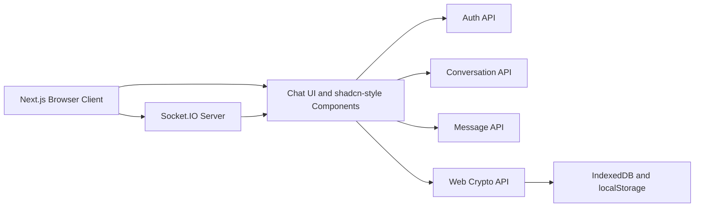
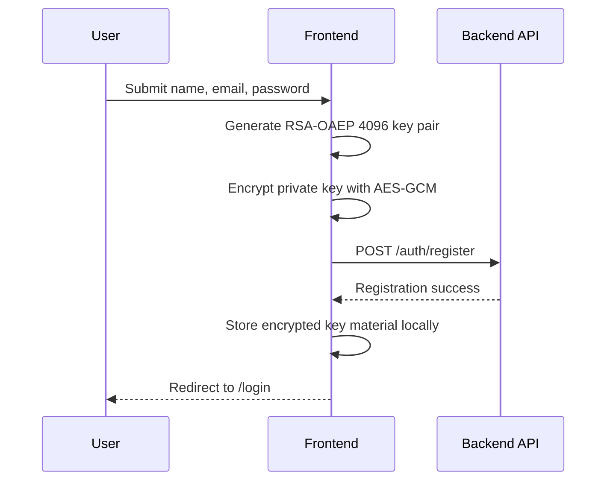

# Akselera Chat Frontend

Frontend aplikasi chat privat berbasis Next.js dengan dukungan autentikasi, percakapan realtime, dan perlindungan pesan menggunakan Web Crypto API.

Dokumen ini menjelaskan tujuan proyek, arsitektur, teknologi, alur data, kontrak API, keamanan, cara menjalankan aplikasi, serta batasan implementasi.

## Daftar Isi

- [Ringkasan](#ringkasan)
- [Fitur Utama](#fitur-utama)
- [Teknologi](#teknologi)
- [Arsitektur](#arsitektur)
- [Alur Utama](#alur-utama)
- [Keamanan dan Enkripsi](#keamanan-dan-enkripsi)
- [Kontrak API](#kontrak-api)
- [Struktur Folder](#struktur-folder)
- [Menjalankan Project](#menjalankan-project)
- [Validasi](#validasi)
- [Catatan Implementasi](#catatan-implementasi)

## Ringkasan

Akselera Chat adalah aplikasi percakapan privat. Frontend bertanggung jawab untuk:

- Menangani register dan login user
- Membuat serta menyimpan key pair user
- Mengenkripsi pesan sebelum dikirim ke backend
- Mendekripsi pesan di browser
- Menampilkan daftar conversation dan unread count
- Mengirim dan menerima pesan secara realtime menggunakan Socket.IO
- Menyediakan interface light/dark monochrome berbasis shadcn-style components

Password plaintext dikirim melalui koneksi API untuk diproses oleh backend. Frontend tidak melakukan hashing password; proses hashing menggunakan Argon2id menjadi tanggung jawab backend.

## Fitur Utama

### Authentication

- Register dengan nama, email, dan password
- Generate RSA-OAEP key pair saat register
- Login melalui `/auth/login`
- Redirect otomatis ke `/chat` setelah login berhasil
- Logout dan pembersihan session key
- Redirect ke login jika session tidak valid

### Conversation

- Load conversation dari API
- Search conversation secara lokal
- Membuat conversation baru melalui modal shadcn-style
- Search user berdasarkan nama atau email melalui `/users`
- Delete conversation
- Mark conversation as read
- Unread count pada setiap conversation
- Conversation terbaru berpindah ke posisi teratas secara realtime

### Messaging

- Load message history
- Encrypt pesan sebelum dikirim melalui REST
- Decrypt pesan di browser
- Bubble sender dan recipient berbeda posisi serta warna
- Date separator: `Today`, `Yesterday`, atau tanggal lengkap
- Timestamp pada setiap bubble
- Scrollable message panel
- Pesan baru masuk realtime melalui Socket.IO

## Teknologi

| Area | Teknologi |
| --- | --- |
| Framework | Next.js 16 App Router |
| Language | TypeScript |
| UI | React 19, Tailwind CSS v4 |
| Component style | shadcn-style local components |
| Icons | lucide-react |
| Realtime | socket.io-client |
| Browser cryptography | Web Crypto API (`SubtleCrypto`) |
| Authentication transport | JWT Bearer token dan cookie credentials |
| Backend password hashing | Argon2id di backend |
| Backend API | REST JSON |
| Database dependency | Sequelize/PostgreSQL packages tersedia untuk ekosistem project |

## Arsitektur



### Layering

1. **Presentation layer**
   - App Router pages di dalam `app/`
   - Reusable UI primitives di dalam `components/ui/`

2. **API layer**
   - Shared HTTP client di `lib/api/client.ts`
   - Domain API modules: auth, users, conversations, dan messages

3. **Crypto layer**
   - User key generation dan private-key unlock
   - Message encryption/decryption
   - Session key persistence

4. **Domain types**
   - Response contract dan view model di `types/chat.ts`

## Alur Utama

### Register



### Login

1. Frontend mengirim email dan plaintext password ke `/auth/login` melalui HTTPS.
2. Backend memvalidasi password menggunakan Argon2id.
3. Frontend mengambil data user melalui `/auth/me`.
4. Frontend mengambil encrypted private key dari response backend atau local key material.
5. Password digunakan untuk membuka private key menggunakan PBKDF2 dan AES-GCM.
6. Private/public key disimpan di memory dan IndexedDB untuk kebutuhan reload browser.
7. User diarahkan ke `/chat`.

### Membuka Conversation

1. Frontend mengambil conversation melalui `GET /conversations`.
2. Unread count ditampilkan pada sidebar.
3. Saat user membuka room, frontend memanggil `PATCH /conversations/:id/read`.
4. Frontend mengambil history dari `GET /conversations/:id/messages`.
5. Setiap message didecrypt menggunakan private key yang tersimpan di browser.

### Mengirim Pesan

1. User menulis plaintext message.
2. Frontend membuat AES-GCM key sementara.
3. Plaintext dienkripsi dengan AES-GCM.
4. AES key dibungkus dengan RSA-OAEP untuk recipient dan sender.
5. Frontend mengirim ciphertext, IV, dan auth tag melalui REST.
6. Backend menyimpan message dan broadcast event `message:new` serta `conversation:updated`.

## Keamanan dan Enkripsi

### User Key Pair

Saat register, frontend membuat key pair:

```ts
{
  name: "RSA-OAEP",
  modulusLength: 4096,
  publicExponent: new Uint8Array([1, 0, 1]),
  hash: "SHA-256"
}
```

Private key tidak dikirim sebagai plaintext. Private key diekspor dalam format PKCS#8, kemudian dienkripsi dengan:

- AES-GCM 256-bit
- PBKDF2
- SHA-256
- Random salt 16 bytes
- Random IV 12 bytes
- 600.000 iterations

### Message Encryption

Setiap pesan menggunakan envelope hybrid:

```json
{
  "algorithm": "AES-GCM",
  "wrapped_keys": {
    "recipient": "base64-rsa-wrapped-aes-key",
    "sender": "base64-rsa-wrapped-aes-key"
  },
  "ciphertext": "base64-message-ciphertext"
}
```

Field yang dikirim ke backend:

```json
{
  "ciphertext": "...",
  "iv": "...",
  "auth_tag": "..."
}
```

AES key dibungkus dua kali agar sender dan recipient dapat membaca pesan yang sama. Decoder juga masih mendukung format legacy dengan field tunggal `wrapped_key`.

### Penyimpanan Key

- `localStorage`: encrypted private key material dan salt per email
- `IndexedDB`: `CryptoKey` session untuk mempertahankan kemampuan decrypt setelah reload
- Password plaintext tidak disimpan
- Logout menghapus key dari memory dan IndexedDB

Gunakan HTTPS di production. Jangan mengirim password atau key melalui koneksi HTTP biasa.

## Kontrak API

Base URL default:

```text
http://127.0.0.1:8001/api/v1
```

### Authentication

```http
POST /auth/register
POST /auth/login
GET  /auth/me
```

Register mengirim:

```json
{
  "name": "User Name",
  "email": "user@example.com",
  "password": "plaintext-password",
  "public_key": "...",
  "encrypted_private_key": "...",
  "key_derivation_salt": "..."
}
```

Login mengirim `email` dan `password`. Backend diharapkan mengembalikan JWT atau mengatur cookie JWT.

### Users

```http
GET /users
```

Frontend menggunakan endpoint ini untuk pencarian user berdasarkan nama/email sebelum membuat conversation.

### Conversations

```http
GET    /conversations
POST   /conversations
PATCH  /conversations/:conversationId/read
DELETE /conversations/:conversationId
```

Create conversation:

```json
{
  "member_email": "dimas@gmail.com"
}
```

Conversation list mendukung field:

```json
{
  "id": "conversation-uuid",
  "unread_count": 3,
  "opponent": {
    "id": "user-uuid",
    "name": "Dimas Rizky",
    "email": "dimas@gmail.com",
    "public_key": "..."
  },
  "last_message": {}
}
```

### Messages

```http
GET  /conversations/:conversationId/messages
POST /conversations/:conversationId/messages
```

Message POST body:

```json
{
  "ciphertext": "...",
  "iv": "...",
  "auth_tag": "..."
}
```

### Socket.IO

Socket URL default:

```text
http://localhost:8001
```

Connection menggunakan JWT atau cookie:

```ts
io(SOCKET_URL, {
  auth: { token: jwtToken },
  withCredentials: true
});
```

Room event:

```ts
socket.emit("conversation:join", conversationId);
socket.emit("conversation:leave", conversationId);
```

Message event:

```ts
socket.on("message:new", (message) => {
  // decrypt and append message
});
```

Conversation list event:

```ts
socket.on("conversation:updated", (data) => {
  // update unread_count, preview, and move conversation to top
});
```

Authentication error:

```ts
socket.on("connect_error", (error) => {
  // show connection/authentication error
});
```

## Struktur Folder

```text
app/
  chat/page.tsx             # Chat workspace, rooms, messages, Socket.IO
  login/page.tsx            # Login and private-key unlock
  register/page.tsx         # Registration and key generation
  globals.css               # Monochrome theme tokens and global styles
  layout.tsx                # Root layout and metadata

components/ui/
  button.tsx                # Button primitive
  card.tsx                  # Card primitive
  dialog.tsx                # Controlled dialog primitive
  header.tsx                # Shared logo, theme, profile, logout header
  input.tsx                 # Input primitive
  mode-toggle.tsx           # Light/dark mode toggle

lib/api/
  client.ts                 # Shared fetch client, JWT/cookie auth
  auth.ts                   # Register, login, current user
  users.ts                  # User list/search source
  conversations.ts          # Conversation CRUD and mark read
  messages.ts               # Message history and create message

lib/crypto/
  user-keys.ts              # RSA key pair and private-key unlock
  messages.ts               # AES-GCM/RSA-OAEP message crypto
  session.ts                # Memory and IndexedDB key session

types/
  chat.ts                   # Conversation, message, user, and room types

public/assets/logo/
  dark.png                 # Logo for light mode
  white.png                # Logo for dark mode
```

## Menjalankan Project

### Requirements

- Node.js 20 atau lebih baru
- npm
- Backend API aktif pada port `8001`
- Backend Socket.IO aktif pada host yang sama

### Install dependency

```bash
npm install
```

### Environment

Buat `.env.local` di root project:

```env
NEXT_PUBLIC_API_URL=http://127.0.0.1:8001/api/v1
NEXT_PUBLIC_SOCKET_URL=http://localhost:8001
```

Jika environment variable tidak diisi, frontend menggunakan URL default di atas.

### Development

```bash
npm run dev
```

Buka:

```text
http://localhost:3000
```

### Production build

```bash
npm run build
npm run start
```

## Validasi

```bash
npm run lint
npm run build
```

`npm run build` menjalankan compile, TypeScript checking, route generation, dan production optimization.

## Catatan Implementasi

### Backend contract

Untuk dekripsi penuh, backend perlu menyediakan:

- `opponent.public_key` pada conversation response
- `encrypted_private_key` dan `key_derivation_salt` pada `/auth/me`, atau key material harus tersedia dari device registration
- Message envelope yang membungkus AES key untuk sender dan recipient

Jika pesan lama hanya memiliki satu `wrapped_key` untuk recipient, sender tidak dapat membuka pesan tersebut. Pesan baru sebaiknya menggunakan `wrapped_keys.sender` dan `wrapped_keys.recipient`.

### Authentication and CORS

Jika menggunakan cookie JWT, backend harus mengaktifkan CORS credentials untuk origin frontend. Jika menggunakan bearer token, login response harus mengembalikan `access_token` atau `token`.

### Realtime behavior

- Socket global user menangani `conversation:updated` untuk sidebar dan unread count.
- Socket room aktif menangani `message:new` untuk bubble chat.
- REST tetap menjadi jalur utama untuk menyimpan message dan mengambil history.
- Socket cleanup dilakukan saat user berpindah room atau logout.

### Security checklist sebelum production

- Gunakan HTTPS dan WSS.
- Jangan simpan password plaintext.
- Validasi dan batasi ukuran ciphertext di backend.
- Jangan log plaintext message atau private key.
- Pastikan public key recipient sudah terverifikasi dan tidak dapat diganti sembarangan.
- Tambahkan refresh token/session expiry handling.
- Pertimbangkan CSP dan secure cookie configuration.
- Uji key recovery di browser/device berbeda.
