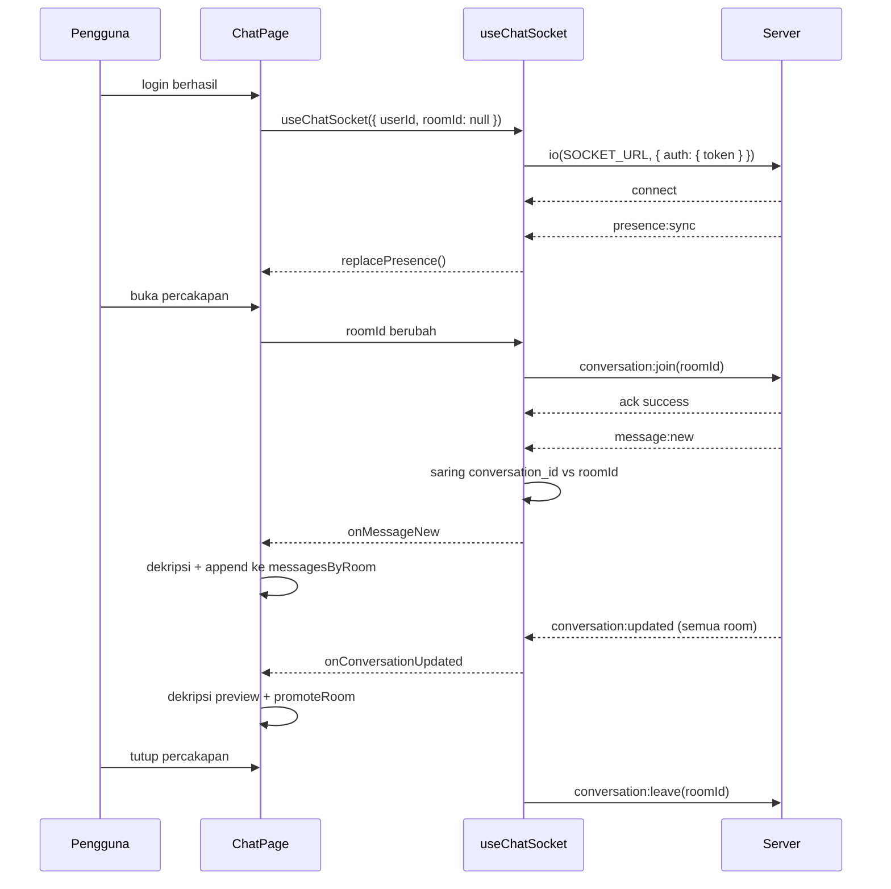

<div align="center">

# Dokumentasi Socket.IO

**Katalog event, siklus hidup koneksi, dan alur realtime pada Akselera Chat.**

</div>

---

> Dokumen ini menjelaskan sisi **frontend**. Sumber kebenaran adalah kode di
> [`lib/chat/use-chat-socket.ts`](../lib/chat/use-chat-socket.ts) dan
> [`lib/presence/store.ts`](../lib/presence/store.ts) — setiap klaim di bawah disertai
> rujukan barisnya supaya bisa ditelusuri balik.

## Daftar Isi

- [Satu Koneksi, Banyak Event](#-satu-koneksi-banyak-event)
- [Handshake dan Autentikasi](#-handshake-dan-autentikasi)
- [Katalog Event](#-katalog-event)
- [Siklus Hidup Koneksi](#-siklus-hidup-koneksi)
- [Subsistem Presence](#-subsistem-presence)
- [Alur Pesan](#-alur-pesan)
- [Enkripsi di Jalur Socket](#-enkripsi-di-jalur-socket)
- [Perilaku Reconnect](#-perilaku-reconnect)
- [Peta File](#-peta-file)
- [Catatan dan Temuan](#-catatan-dan-temuan)

---

## 🔌 Satu Koneksi, Banyak Event

Yang dipakai **hanya satu koneksi** `socket.io`, bukan beberapa. Koneksi itu membawa
banyak *named event*.

```ts
// lib/chat/use-chat-socket.ts:9
export const SOCKET_URL = process.env.NEXT_PUBLIC_SOCKET_URL || "http://localhost:8001";
```

Socket menempel di origin yang sama dengan REST API (`NEXT_PUBLIC_API_URL`). Pembagian
tugasnya tegas:

| Arah | Lewat | Alasan |
|---|---|---|
| **Kirim** pesan | REST (`POST`) | Butuh response pasti + status HTTP untuk error handling |
| **Terima** pesan | Socket | Didorong server, tanpa polling |
| **Status presence** | Socket | Berubah kapan saja, tidak bisa diprediksi |

> Socket **tidak** dipakai untuk mengirim pesan. Lihat [Alur Pesan](#-alur-pesan).

---

## 🤝 Handshake dan Autentikasi

```ts
// lib/chat/use-chat-socket.ts:52-56
const token = getAuthToken();
const socket = io(SOCKET_URL, {
  auth: token ? { token } : undefined,
  withCredentials: true,
});
```

JWT dikirim di payload handshake (bukan header `Authorization`), karena WebSocket tidak
mendukung header kustom saat *upgrade*. Kalau token ditolak, server memicu `connect_error`.

`withCredentials: true` ikut dikirim untuk berjaga bila backend memakai cookie, meski
autentikasi utama tetap lewat `auth.token`.

> Nilai `SOCKET_URL` perlu diperhatikan — lihat [Catatan dan Temuan](#-catatan-dan-temuan).

---

## 📡 Katalog Event

### Frontend → Backend (`emit`)

| Event | Payload | Ack | Lokasi |
|---|---|---|---|
| `conversation:join` | `roomId: string` | `{ success: boolean; message?: string }` | [`use-chat-socket.ts:86`](../lib/chat/use-chat-socket.ts) |
| `conversation:leave` | `roomId: string` | — | [`use-chat-socket.ts:105`](../lib/chat/use-chat-socket.ts) |
| `presence:get` | `string[]` (user id) | `{ success?: boolean; presence?: Presence[] }` | [`use-chat-socket.ts:113`](../lib/chat/use-chat-socket.ts) |

Ketiganya memakai pola **acknowledgement**: argumen terakhir adalah callback yang dipanggil
server. Ini yang membuat kegagalan `join` bisa dilaporkan ke UI, bukan hilang diam-diam.

### Backend → Frontend (`on`)

| Event | Payload | Efek di frontend |
|---|---|---|
| `connect_error` | `Error` | `setMessageError("Socket authentication failed: …")` |
| `presence:sync` | `{ presence: Presence[] }` | `replacePresence()` — **ganti seluruh** map |
| `presence:update` | `Presence` | `setPresence([p])` — **merge satu** user |
| `conversation:updated` | `ConversationUpdatedEvent` | Perbarui preview + unread di sidebar |
| `message:new` | `EncryptedMessage` | Tambahkan pesan ke percakapan yang terbuka |
| `connect` (bawaan) | — | Re-join room setelah reconnect |

### Bentuk payload

```ts
// types/chat.ts:46-54
type EncryptedMessage = {
  id: string;
  conversation_id: string;
  sender_id: string;
  ciphertext: string;   // isi pesan terenkripsi
  iv: string;
  auth_tag: string;
  created_at: string;
};

// lib/chat/use-chat-socket.ts:11-16
type ConversationUpdatedEvent = {
  conversation_id: string;
  last_message: EncryptedMessage;
  updated_at: string;
  unread_count: number;
};

// lib/presence/store.ts:5-9
type Presence = {
  user_id: string;
  is_online: boolean;
  last_seen_at: string | null;
};
```

---

## 🔄 Siklus Hidup Koneksi

Hook [`useChatSocket`](../lib/chat/use-chat-socket.ts) memakai **tiga `useEffect` berlapis**
dengan tanggung jawab berbeda. Ini bagian yang paling menentukan perilaku realtime.

### Lapisan 1 — simpan handler terbaru (`:45-47`)

```ts
useEffect(() => {
  handlersRef.current = { onConnectError, onJoinError, /* … */ };
});
```

Tanpa dependency array, jadi jalan **setiap render**. Tujuannya: listener socket
didaftarkan sekali (di lapisan 2), tapi harus selalu memanggil closure terbaru. Tanpa ini,
listener akan memegang state basi dari render pertama.

Konsekuensinya saat menambah handler baru: **wajib didaftarkan juga di objek ini**, kalau
tidak, handler-nya diam-diam tidak pernah terpanggil.

### Lapisan 2 — koneksi (`:49-79`, dep `[userId]`)

```
if (!userId) return                    ← belum login = belum connect
io(SOCKET_URL, { auth, withCredentials })
├─ on("connect_error")        → onConnectError
├─ on("presence:sync")        → onPresenceSync     (divalidasi Array.isArray)
├─ on("presence:update")      → onPresenceUpdate   (divalidasi presence?.user_id)
└─ on("conversation:updated") → onConversationUpdated
cleanup → socket.disconnect()
```

Koneksi hidup selama pengguna login — **tidak** bergantung pada room yang dibuka. Jadi
`presence:sync`, `presence:update`, dan `conversation:updated` tetap mengalir walau tidak
ada percakapan yang sedang dibuka.

### Lapisan 3 — room (`:81-107`, dep `[userId, roomId]`)

```
if (!socket || !roomId) return
join()                                 → emit conversation:join + ack
on("connect", join)                    → re-join otomatis setelah reconnect
on("message:new", handleMessage)
cleanup → off("connect"), off("message:new"), emit conversation:leave
```

`handleMessage` menyaring sebelum diteruskan:

```ts
// :93-96
function handleMessage(message: EncryptedMessage) {
  if (message.conversation_id !== roomId) return;
  void handlersRef.current.onMessageNew?.(message);
}
```

Jadi `message:new` **hanya** diproses untuk room yang sedang terbuka. Berpindah room akan
`leave` room lama lalu `join` room baru.

### Diagram urutan



---

## 🟢 Subsistem Presence

Presence **tidak** memakai React state, melainkan *external store* kecil
([`lib/presence/store.ts`](../lib/presence/store.ts)):

```ts
// :23-24
const presenceByUserId = new Map<string, Presence>();
const listeners = new Set<() => void>();
```

Alasannya: callback socket berjalan **di luar siklus render React**, jadi tidak bisa
memanggil `setState` milik komponen. Store ini menyimpan data di level modul, lalu
komponen membacanya lewat `useSyncExternalStore` (`:100-105`).

`setPresence` hanya memanggil `emit()` kalau ada nilai yang benar-benar berubah (`:36-56`),
sehingga event presence yang berulang tidak memicu re-render percuma.

### Tiga sumber data

| # | Sumber | Lokasi | Sifat |
|---|---|---|---|
| 1 | REST saat bootstrap | [`use-chat-bootstrap.ts:45`](../lib/chat/use-chat-bootstrap.ts) → `seedPresence(opponent)` | Sekali, saat halaman dibuka |
| 2 | `presence:get` manual | [`new-conversation-dialog.tsx:48-49`](../components/chat/new-conversation-dialog.tsx) | Saat dialog "New conversation" dibuka |
| 3 | Event socket | `presence:sync` (bulk) & `presence:update` (satu user) | Selama koneksi hidup |

Sumber 1 dan 2 memanfaatkan field `is_online` / `last_seen_at` yang sudah ikut pada
response REST — jadi tampilan awal sudah terisi sebelum socket sempat mengirim apa pun.

```ts
// new-conversation-dialog.tsx:48-49
seedPresence(fetchedUsers);
onRequestPresence(fetchedUsers.map((user) => String(user.id)));
```

### Perbedaan `sync` vs `update`

| Event | Perilaku | Fungsi |
|---|---|---|
| `presence:sync` | **Reset** seluruh map lalu isi ulang | `replacePresence()` |
| `presence:update` | **Merge** satu user | `setPresence([p])` |

### Konsumen

| Komponen | Tampilan |
|---|---|
| `PresenceDot` | Titik hijau di pojok avatar; tidak merender apa pun saat offline |
| `PresenceLabel` | `"Online"` atau `"Terakhir dilihat …"` (locale `id`) |

---

## 💬 Alur Pesan

### A. Pesan masuk ke room yang terbuka

```
Server push "message:new"
  └─ filter: message.conversation_id !== roomId → dibuang
  └─ handleIncomingMessage            (app/chat/page.tsx:121-125)
       ├─ decryptMessages([msg], getPrivateKey())
       ├─ appendMessages(messagesByRoom, conversation_id)
       └─ updateRoom(rooms, conversation_id, summary)
```

### B. Sidebar — semua percakapan

```
Server push "conversation:updated"
  └─ handleConversationUpdated        (app/chat/page.tsx:98-119)
       ├─ decryptMessage(last_message) → preview
       └─ promoteRoom({ preview, time, unreadCount })
```

`conversation:updated` **tidak difilter per room** — event ini datang untuk semua
percakapan. Inilah yang menggerakkan preview terakhir dan badge unread di sidebar,
termasuk untuk chat yang sedang tidak dibuka. `promoteRoom` juga memindahkan percakapan
tersebut ke posisi teratas.

### C. Pesan keluar — lewat REST

```
handleSend                            (app/chat/page.tsx:168-198)
  ├─ encryptMessage(text, recipientPublicKey, senderPublicKey)   ← E2E di client
  ├─ createMessage() → POST /conversations/{id}/messages         ← HTTP, bukan emit
  ├─ decrypt balik response
  └─ appendMessages + updateRoom                                 ← optimistic
```

Pesan yang dikirim **tidak di-echo** balik oleh server ke pengirim. Pengirim
menampilkannya dari response REST; penerima mendapatkannya lewat `message:new` dan
`conversation:updated`.

> Karena itu, mengirim pesan tetap berhasil walau socket sedang terputus — hanya
> penerimaan realtime-nya yang tertunda sampai reconnect.

---

## 🔐 Enkripsi di Jalur Socket

Semua payload socket adalah **ciphertext**. Server hanya menyimpan dan meneruskan; ia tidak
pernah memegang plaintext maupun kunci privat.

| Event | Yang melewati kabel |
|---|---|
| `message:new` | `ciphertext` + `iv` + `auth_tag` |
| `conversation:updated` | `last_message` (ciphertext) |
| `presence:*` | Hanya metadata status — tanpa isi pesan |

Dekripsi terjadi di client dengan `getPrivateKey()`. Kalau kunci privat tidak tersedia,
preview jatuh ke `ENCRYPTED_PLACEHOLDER` (`app/chat/page.tsx:100-106`) alih-alih
melempar error.

---

## ♻️ Perilaku Reconnect

`socket.io-client` melakukan reconnect otomatis. Yang perlu diperhatikan: **room hilang
setelah reconnect**, karena keanggotaan room hidup di sisi server.

Penanganannya:

```ts
// :98-100
if (socket.connected) join();
socket.on("connect", join);
```

`join` dipanggil dua kali dengan sengaja:
- saat ini juga, kalau socket sudah tersambung (efek baru jalan setelah room dipilih)
- lewat listener `connect`, untuk setiap reconnect berikutnya

Tanpa baris `socket.on("connect", join)`, setelah jaringan sempat putus pengguna akan
tetap "di dalam" percakapan secara tampilan, tapi tidak pernah menerima `message:new` lagi.

---

## 📁 Peta File

| File | Peran |
|---|---|
| [`lib/chat/use-chat-socket.ts`](../lib/chat/use-chat-socket.ts) | Hook koneksi, katalog event, `requestPresence` |
| [`lib/presence/store.ts`](../lib/presence/store.ts) | External store presence + `usePresence` |
| [`components/ui/presence.tsx`](../components/ui/presence.tsx) | `PresenceDot`, `PresenceLabel`, `presenceLabel()` |
| [`app/chat/page.tsx`](../app/chat/page.tsx) | Konsumen utama: handler, kirim pesan, orkestrasi state |
| [`lib/chat/use-chat-bootstrap.ts`](../lib/chat/use-chat-bootstrap.ts) | Seed presence awal dari response REST |
| [`lib/api/messages.ts`](../lib/api/messages.ts) | Jalur REST untuk kirim & ambil pesan |
| [`types/chat.ts`](../types/chat.ts) | Tipe `EncryptedMessage`, `Conversation`, `Room` |

---

## ⚠️ Catatan dan Temuan

### 1. `NEXT_PUBLIC_SOCKET_URL` belum di-set

`.env.local` hanya berisi `NEXT_PUBLIC_API_URL=http://127.0.0.1:8001/api/v1`, sehingga
socket jatuh ke nilai fallback `http://localhost:8001`.

Bedanya: REST menuju `127.0.0.1`, socket menuju `localhost`. Portnya sama, tapi browser
memperlakukan keduanya sebagai **origin berbeda**. Karena autentikasi socket memakai
`auth: { token }` (bukan cookie), ini kemungkinan besar tetap berjalan — tapi
`withCredentials: true` jadi tidak ada gunanya. Sebaiknya hostname-nya disamakan.

### 2. Dua warning lint soal `setRooms`

Keduanya sudah ada sebelum perubahan tema, dan tidak berbahaya (`setRooms` dari `useState`
stabil secara referensi):

| Lokasi | Isi |
|---|---|
| `app/chat/page.tsx:129` | `handleRequestPresence` memasukkan `setRooms` ke deps padahal body-nya tidak memakainya |
| `app/chat/page.tsx:135` | `handleConversationCreated` memakai `setRooms` tapi deps-nya `[]` |

### 3. Tabel event di README utama perlu diperbarui

README utama mencantumkan event **`presence:online`**, sedangkan kode memakai
**`presence:sync`** dan **`presence:update`**. Tabel itu juga belum memuat
`presence:get` dan ack `conversation:join`. Halaman ini yang mencerminkan kode saat ini —
README utama sebaiknya diselaraskan atau diarahkan ke dokumen ini.

### 4. `handlersRef` harus dijaga saat menambah handler

Lihat [Lapisan 1](#lapisan-1--simpan-handler-terbaru-45-47). Handler baru yang lupa
didaftarkan di objek `handlersRef.current` tidak akan pernah terpanggil, tanpa error
apa pun — jenis kesalahan yang sulit dilacak.
